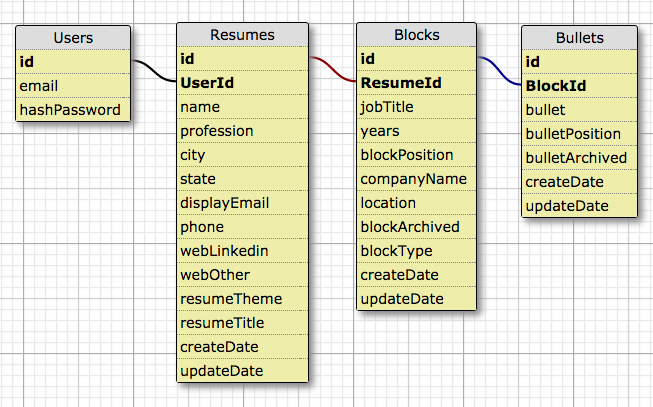

# Rezable.io #

* Data Model

---

The data model allows users to have save resumes containing multiple blocks of job history, project experience, or educational information containing multiple bullets of detailed description. In short, Users share a one to many relationship with Resumes, Resumes share a one to many relationship with Blocks, and Blocks share a one to any relationship with Bullets.

Future features of rezable will include the ability to save resumes per user. Our data model accounts for this future enhancement.
